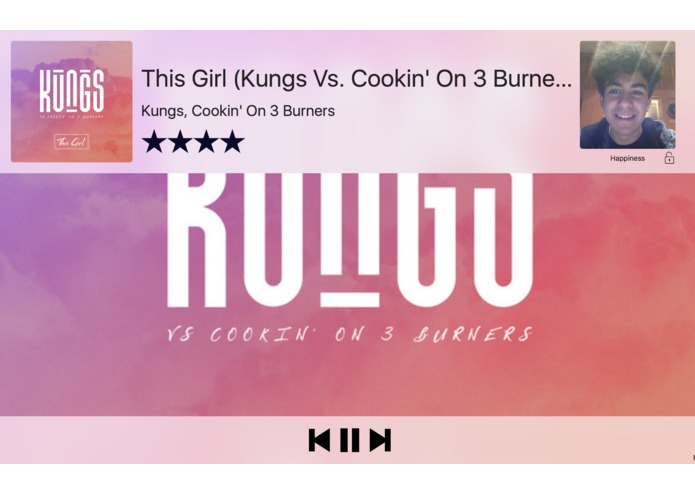

# Moodinator 
Imagine that you're coming home after a long and stressful work day and you just want to relax by listening to music. Instead of just diving into a new world, you have to think about what you want to listen to and find the songs. By the time you find what you're looking for, you probably don't care about listening to music anymore. Imagine that the song gets selected automatically for you, depending on your mood with no extra input from you. It just works like magic.

## Licence 
The SDK is licensed under the Apache License 2.0. For more details, see [ LICENSE ](LICENSE).
The SDK uses the [ Microsoft Cognitive Services ](https://www.microsoft.com/cognitive-services/). Developers using this are expected to follow the “Developer Code of Conduct for Microsoft Cognitive Services” at http://go.microsoft.com/fwlink/?LinkId=698895.
Data submitted may be retained by Microsoft for service improvement purposes, along with the other stipulations noted in the following documents: Cognitive Services TOU, Developer Code of Conduct
This project follows the Cognitive Services TOU